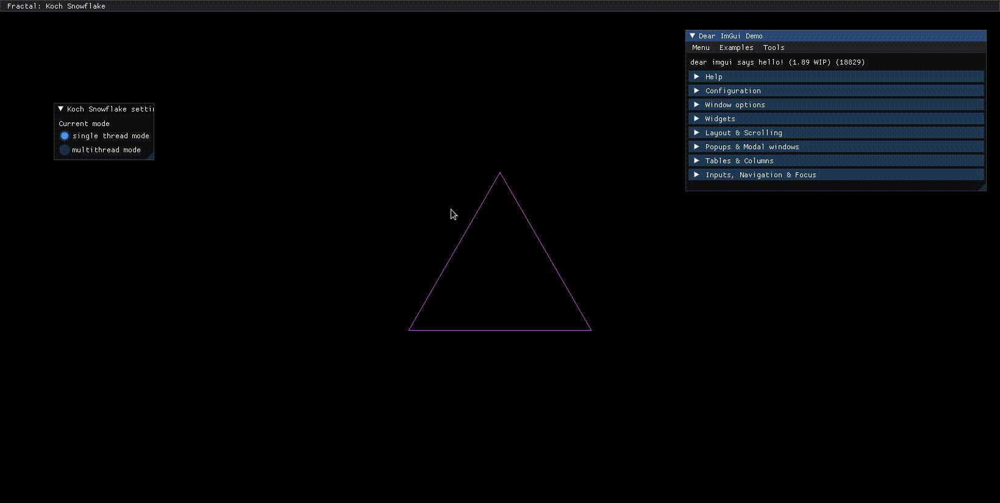

# fraktals

## About fraktals

fraktals is an efficient fractals explorer program. It provides
* browsing feature
* step-by-step fractal algorithm operations
* procedural and parallel computation
<!-- * step back & fast foward -->
<!-- * +30 2D and 3D fractals -->
<!-- * save to image or gif -->

## Getting Started

## Developers and testers

