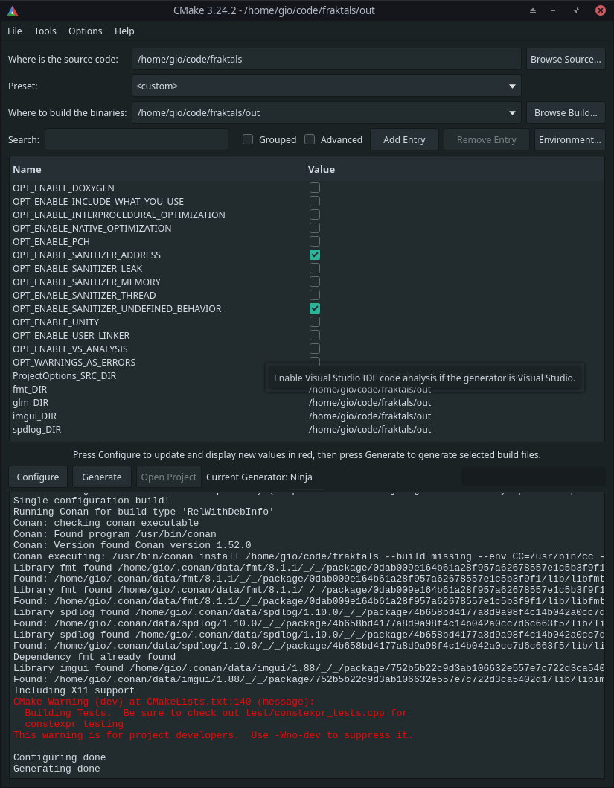

## Build Instructions

A full build has different steps:
1) Install dependences
2) Configure the build
3) Build the project
4) Editing & git directives

### (1) Install dependences

* [clang](https://clang.llvm.org/)
<details>
	<summary>Install commands (Linux) </summary>


</details>

* [conan](https://conan.io/)
<details>
	<summary>Install commands (Linux) </summary>


</details>

* [cmake](https://cmake.org/)
<details>
	<summary>Install commands (Linux) </summary>


</details>

* [cppcheck](http://cppcheck.sourceforge.net/)
<details>
	<summary>Install commands (Linux) </summary>


</details>

* [glm](https://github.com/g-truc/glm)
<details>
	<summary>Install commands (Linux) </summary>


</details>

* [optional]()
<details>
	<summary>Install commands (Linux) </summary>


</details>

### (2) Configure the build

To configure the project, use `cmake` or `cmake-gui`.

#### (2.a) Configuring via cmake:

TODO

#### (2.b) Configuring via cmake-gui:

Open the GUI in the project root folder:

```
cmake-gui .
```
Set the build directory to `out`, disable warnings-as-errors and generate. For further debugging set the sanitizers, same goes for optimization.




### (3) Build the project
Build the project for all targets:
```
    cmake --build out/build/unixlike-clang-debug/
```

or

```
TODO
```
### Editing and git directives
TODO
